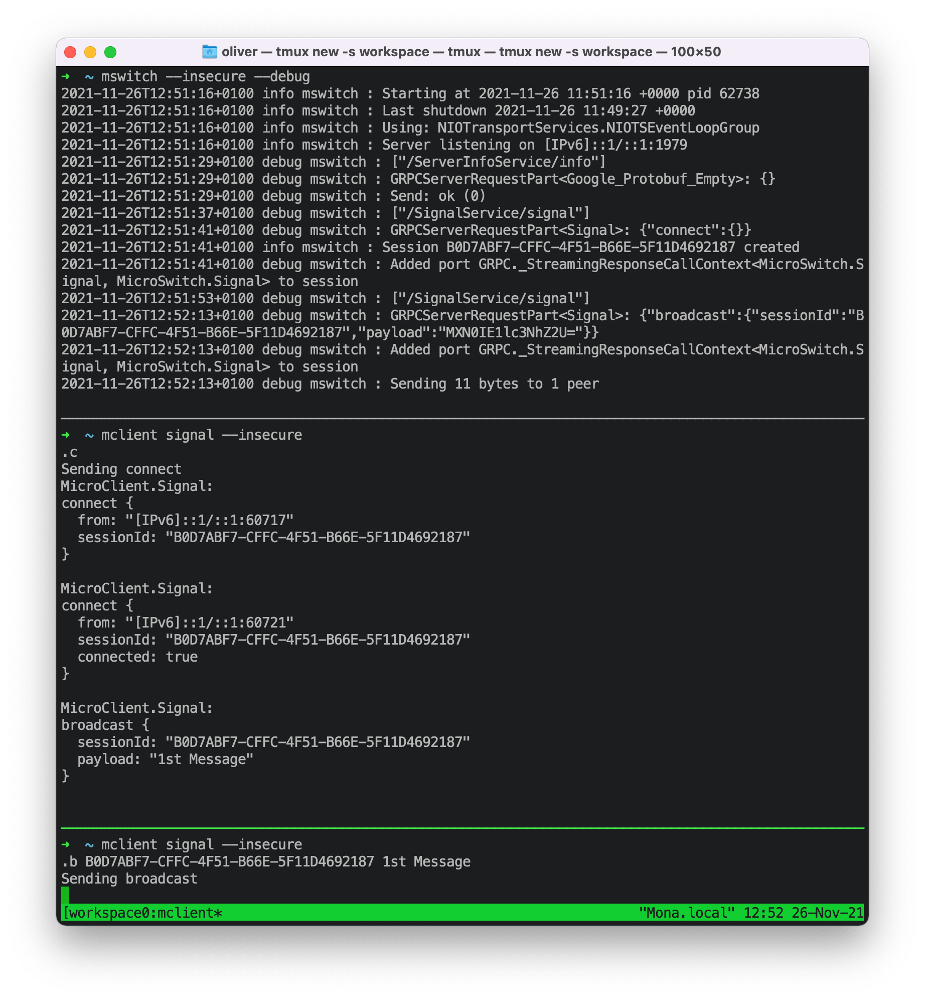

# µSwitch

## What ist MicroSwitch

It's a well behaved gRPC server that has support for TLS and runs on macOS and Linux.

It supports broadcasting arbitrary messages to peers that are connected to a virtual switch, hence the name.
Peers can be invited via Apple Push notifcation services. I initially started it as a building block for a WebRTC
signaling server. You can easily use it to setup a simple chat service (no message history, though).



## Get started

### First start

- Generate the model files

```bash
sh ./generate.sh
```

- start the server without SSL enabled

```bash
swift run mswitch --insecure
```

You should have a server running on ::1:1979, now. You can change ip and port via `--host` and `--port`

- Check the server uptime

```bash
swift run mclient --insecure
```


### Create a self signed x509 certificate

```bash
openssl genrsa -out <your.server>.key 2048
openssl req -new -key <your_srver>.key -out <your.server>.csr
openssl req -x509 -days 10 -key <your.server>.key -in <your.server>.csr -out <your.server>.pem
```

Hint: `hostname | tr "[:upper:]" "[:lower:]"` might be a good choice for <your.server>.
You can either delete the certificate signing request or reuse it after 10 days.

### Create a personal information exchange file

This is needed if you want to run a server on macOS

```bash
openssl pkcs12 -export -out <your.server>.pfx -inkey <your.server>.key -in <your.server>.pem
```

### Install the pfx file
- Open keychain and create a new keychain. Keychain will install new certificates in the last keychain that was opened.
- Double click the pfx file to install into your new keychain. You should now have a cert and a key installed.

### Second start
- start the server with SSL enabled on macOS

```bash
swift run mswitch -h <your.server>
```

**The server name is important because that's whats going to be looked up in the keychain.**

- check that SSL is enabled

```bash
openssl s_client -connect <your.server>:<port>
```

**To be able to run the client you need to allow the self-signed x509 certificate. So got to keychain and enable trust.**

- check the uptime with SSL enabled

```bash
swift run mclient server-info -h <your.server>
```

### Third start (POSIX mode)
Since Linux cannot load the identity from the keychain you need to install the certificate and keyfile into the config dir and create links (cert.pem and key.pem) pointing to your files.

```bash
mkdir -p .mswitch/etc
cp <your.server>.pem .mswitch/etc/
cp <your.server>.key .mswitch/etc/
pushd .mswitch/etc
ln -sf <your.server>.pem cert.pem
ln -sf <your.server>.key cert.key
popd
```

You can force the server to use POSIX mode via `--forcePosix`

```bash
swift run mswitch -h <your.server> --forcePosix
```

Important: In Linux POSIX mode is the default.

## Enable Apple Push notification

- add APNS Config

```bash
mv APNConfig_default.json.example .mswitch/etc/APNConfig_default.json
```

- add a push token for a handle with

```bash
swift run mclient token --action add <token> <handle>
```

- you can send an invite via

```bash
swift run mclient invite --session <uuid> <from>
```
